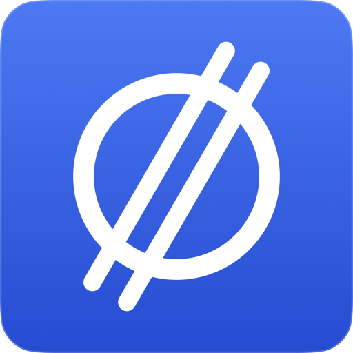
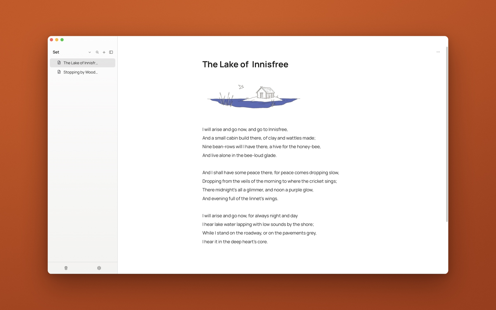

#  Set

[](https://github.com/rootstring/set/actions/workflows/ci.yml)
[](https://github.com/rootstring/set/releases/latest)

[](LICENSE)

Set is a simple Markdown based note-taking app that stores all your documents locally as Markdown files.



## Features

- Block editor: headings, lists, to-dos, toggles, quotes, code blocks, tables, images, equations and
  links, with a `/` command menu and Markdown shortcuts
- Nested pages in a sidebar tree, reordered by drag and drop
- Contexts: separate top-level folders, each with its own page tree, that you switch between
- Every page is a plain Markdown file in a folder you choose; changes made outside Set are picked up
- Quick switcher (⌘K) that searches page titles and content
- Page locking, and trash with restore
- Device-to-device sync with no server or account
- Local [MCP](https://modelcontextprotocol.io) server so agents can search and read your notes
- Optional on-device dictation
- Light and dark themes, accent colors, font options and rebindable shortcuts
- Runs on macOS, Windows and Linux, plus a web only build

## Built with

- [Tauri 2](https://tauri.app) (Rust)
- [Svelte 5](https://svelte.dev) and SvelteKit, TypeScript, Vite
- [TipTap](https://tiptap.dev) (ProseMirror) for the editor
- [KaTeX](https://katex.org) for equations
- [iroh](https://www.iroh.computer) for sync
- [whisper.cpp](https://github.com/ggml-org/whisper.cpp) for dictation

## Download

Get the latest build for macOS, Windows, or Linux from
[Releases](https://github.com/rootstring/set/releases/latest).


## Run locally

```bash
pnpm install
pnpm tauri dev
```

## Docs

- [Development](docs/development.md)
- [Architecture](docs/architecture.md)
- [MCP server](docs/mcp.md)
- [Search](docs/search.md)
- [Sync](docs/sync.md)

## License

[AGPL-3.0](LICENSE)

The license covers the code, not the Set name or icon. If you distribute a modified version, give it
a different name and icon.

The bundled fonts, Manrope and Roboto Serif, are under the SIL Open Font License 1.1 (see
[`static/fonts/`](static/fonts/)), as are KaTeX's.
